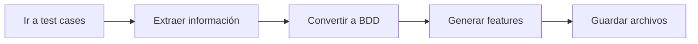
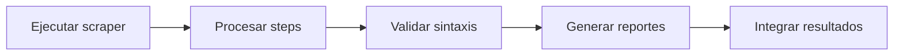

# 🚀 INTEGRACIÓN DE SCRIPTS CON BDD CUCUMBER

## 📋 **Descripción General**

Este sistema permite usar los **scripts de procesamiento** directamente dentro de **flujos BDD Cucumber** mediante **comandos nativos de Cypress**. 

**¿Por qué es importante?**
- ✅ **Análisis dinámico** durante la ejecución de tests
- ✅ **Generación de casuística** basada en datos reales
- ✅ **Integración nativa** con el ecosistema Cypress
- ✅ **Flujos BDD** que se adaptan automáticamente
- ✅ **Scripts como parte del testing**, no externos

---

## 🎯 **Casos de Uso Principales**

### 1. **Mapeo Dinámico de Elementos**
```gherkin
Escenario: Mapear página automáticamente
  Cuando mapeo todos los elementos de la página actual
  Y valido que los elementos mapeados funcionan correctamente
  Entonces verifico que se encontraron al menos 10 elementos
```

### 2. **Extracción de Casos a BDD**
```gherkin
Escenario: Convertir casos existentes a BDD
  Cuando extraigo toda la información de casos disponibles
  Y convierto los casos extraídos a formato BDD
  Entonces verifico que se extrajeron múltiples secciones
```

### 3. **Generación Dinámica de Steps**
```gherkin
Escenario: Crear steps automáticamente
  Cuando genero steps dinámicos basados en los elementos encontrados
  Entonces verifico que se generaron steps de navegación
  Y verifico que se generaron steps de formularios
```

---

## 🛠️ **Comandos Disponibles**

### **Comandos de Mapeo**
- `cy.mapPageElements(options)` - Mapea elementos de la página
- `cy.validateMappedElements()` - Valida que los elementos funcionan
- `cy.generateDynamicSteps()` - Crea steps basados en elementos

### **Comandos de Extracción**
- `cy.extractTestCasesToBDD(selector)` - Extrae casos y convierte a BDD
- `cy.generateDynamicFeature(section, cases)` - Crea features dinámicos

### **Comandos de Procesamiento**
- `cy.processWithIntelligentSystem(data, type)` - Usa el sistema de auto aprendizaje
- `cy.runUnifiedProcessor(options)` - Ejecuta el procesador completo

### **Comandos de Flujo**
- `cy.runFullAnalysisFlow(options)` - Ejecuta análisis completo
- `cy.task('runFullAnalysisWorkflow', options)` - Workflow automatizado

---

## 📁 **Estructura de Archivos**

```
📦 academy2025-cypress-basic/
├── 🔧 cypress/
│   ├── 📄 support/
│   │   └── commands.js           # ← Comandos integrados
│   ├── 📋 e2e/
│   │   ├── 📄 features/
│   │   │   ├── dynamic-analysis.feature  # ← Feature principal
│   │   │   └── dynamic-*.feature         # ← Features generados
│   │   └── 📄 step_definitions/
│   │       └── dynamicAnalysisSteps.js   # ← Steps integrados
│   └── 📊 reports/
│       ├── discovered-elements.json      # ← Elementos mapeados
│       ├── extracted-bdd-cases.json      # ← Casos extraídos
│       └── full-analysis-workflow.json   # ← Reporte workflow
├── 🛠️ scripts/
│   ├── intelligentStepGenerator.js      # ← Generador 
│   ├── unifiedScraperProcessor.js       # ← Procesador unificado
│   └── intelligentStepManager.js        # ← Gestor de steps
└── ⚙️ cypress.config.js                  # ← Tasks integradas
```

---

## 🔄 **Flujos de Trabajo**

### **Flujo 1: Análisis Exploratorio**


### **Flujo 2: Extracción de Casos**


### **Flujo 3: Procesamiento Completo**


---

## 🎮 **Ejemplos de Uso**

### **Ejemplo 1: Mapeo Básico**
```javascript
// En un step definition
When("mapeo la página actual", () => {
    cy.mapPageElements({
        includeNavigation: true,
        includeButtons: true,
        saveToFile: true
    });
    
    cy.get('@discoveredElements').then((elements) => {
        cy.log(`Elementos encontrados: ${elements.metadata.totalElements}`);
    });
});
```

### **Ejemplo 2: Generación Dinámica**
```javascript
// Generar feature automáticamente
When("creo feature dinámico para shop", () => {
    const testCases = [
        { titulo: "Filtrar por precio", pasos: ["Given navego a shop", "When filtro precios"] },
        { titulo: "Agregar al carrito", pasos: ["Given selecciono producto", "When agrego carrito"] }
    ];
    
    cy.generateDynamicFeature("shop", testCases);
});
```

### **Ejemplo 3: Workflow Completo**
```javascript
// Ejecutar análisis completo
When("ejecuto análisis completo", () => {
    cy.runFullAnalysisFlow({
        mapElements: true,
        extractCases: true,
        generateSteps: true,
        saveToDisk: true
    });
});
```

---

## 📊 **Datos Generados**

### **discovered-elements.json**
```json
{
  "metadata": {
    "url": "https://automationtesting.co.uk/",
    "timestamp": "2025-05-28T23:00:00.000Z",
    "totalElements": 45
  },
  "navigation": [
    {
      "text": "Shop",
      "href": "/shop",
      "selectors": ["#menu-item-shop", ".nav-shop", "a:contains('Shop')"]
    }
  ],
  "buttons": [
    {
      "text": "Add to Cart",
      "selectors": [".add-to-cart", "button[data-product-id]"]
    }
  ]
}
```

### **extracted-bdd-cases.json**
```json
{
  "Home Page": [
    {
      "titulo": "Home Page with three Sliders only",
      "pasos": [
        "Given navego a la sección \"Home Page\"",
        "When ejecuto el caso \"Home Page with three Sliders only\"",
        "Then verifico que el resultado es el esperado"
      ]
    }
  ]
}
```

---

## 🚀 **Ejecución**

### **Comando Directo**
```bash
# Ejecutar feature con integración
npx cypress run --spec "cypress/e2e/features/dynamic-analysis.feature"

# Ejecutar escenario específico
npx cypress run --spec "cypress/e2e/features/dynamic-analysis.feature" --env grep="@mapeo"
```

### **Scripts NPM**
```bash
# Análisis dinámico completo
npm run cypress:dynamic

# Solo mapeo de elementos
npm run cypress:mapping

# Solo extracción de casos
npm run cypress:extraction
```

---

## 🔧 **Configuración Avanzada**

### **Personalizar Comandos**
```javascript
// En cypress/support/commands.js
Cypress.Commands.add('myCustomAnalysis', (options) => {
    // Tu lógica personalizada
    cy.mapPageElements(options);
    cy.processWithIntelligentSystem();
});
```

### **Configurar Tasks**
```javascript
// En cypress.config.js
on('task', {
    myCustomTask(data) {
        // Procesar datos personalizados
        return processCustomData(data);
    }
});
```

---

## 💡 **Ventajas del Sistema**

### **Para QA Teams**
✅ **Análisis automático** de páginas web  
✅ **Generación dinámica** de casos de prueba  
✅ **Integración natural** con flujos BDD  
✅ **Reducción de trabajo manual** significativa  

### **Para Developers**
✅ **Comandos reutilizables** y modulares  
✅ **Integración nativa** con Cypress  
✅ **Scripts como parte del testing**  
✅ **Reportes automáticos** de calidad  

### **Para el Proyecto**
✅ **Mantenimiento reducido** de scripts  
✅ **Consistencia** en procesos  
✅ **Escalabilidad** mejorada  
✅ **Calidad** asegurada automáticamente  

---

## 🎯 **Próximos Pasos**

1. **Ejecutar** el feature `dynamic-analysis.feature`
2. **Revisar** los reportes generados en `cypress/reports/`
3. **Personalizar** comandos según necesidades
4. **Integrar** con tu flujo de CI/CD
5. **Expandir** con más casos de uso

---

## 🔍 **Troubleshooting**

### **Error: Command not found**
```bash
# Verificar que commands.js está importado
# En cypress/support/e2e.js:
import './commands'
```

### **Error: Task not registered**
```bash
# Verificar que tasks están en cypress.config.js
# Reiniciar Cypress si es necesario
```

### **Error: Scripts no encontrados**
```bash
# Verificar rutas en commands.js
const { IntelligentStepGenerator } = require('../scripts/intelligentStepGenerator');
```

---

- 🧠 **Scripts generativos de Casuística**
- 🧪 **Testing BDD**
- ⚡ **Cypress nativo**
- 📊 **Análisis dinámico**
